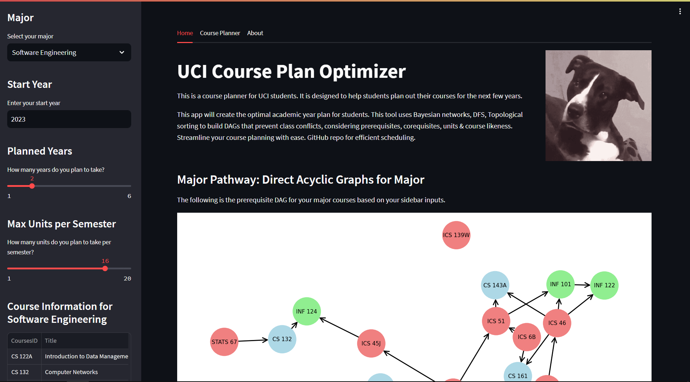
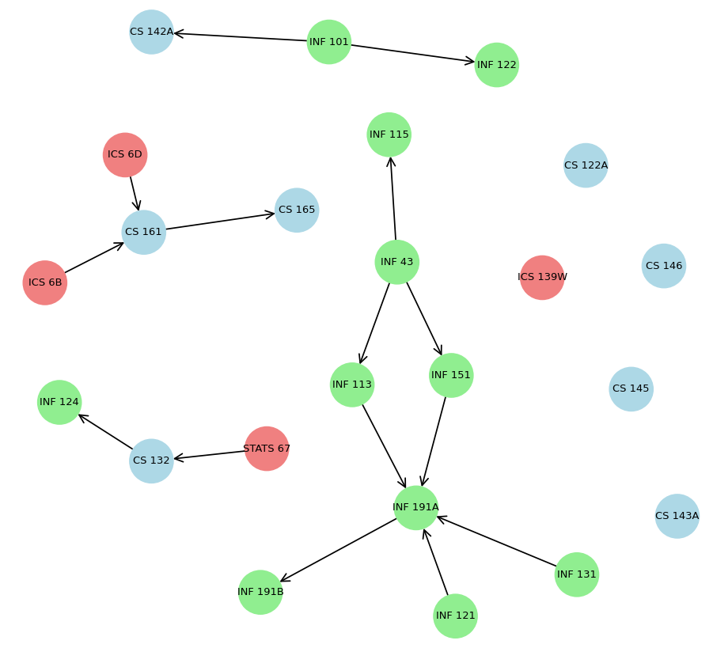

# Course Plan Optimizer
Create optimal academic year plans for students. This tool uses Bayesian networks, DFS, Topological sorting to build DAGs that prevent class conflicts, considering prerequisites, corequisites, units & course likeness. Streamline your course planning with ease. GitHub repo for efficient scheduling.

## Home Page

## Prerequisites Direct Acyclic Graph

## Course Plan Optimizer
