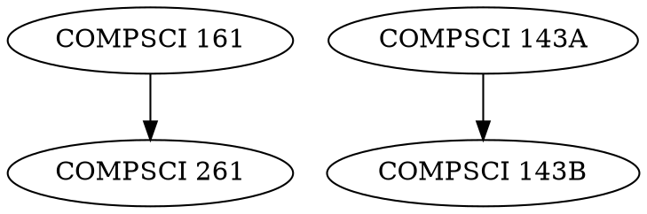

# Alternative Tools for Course Prerequisite Visualization

While the current Python implementation using NetworkX and Matplotlib works well, here are some alternative tools that might provide more interactive or visually appealing visualizations:

## 1. D3.js (JavaScript)

**Pros:**
- Interactive visualizations
- Highly customizable
- Web-based (viewable in browsers)
- Many layout algorithms

**Cons:**
- Steeper learning curve
- Requires JavaScript knowledge

[D3.js website](https://d3js.org/)

Implementation would involve creating a JSON export of the graph and then using D3 to render it in HTML.

## 2. Graphviz (via DOT language)

**Pros:**
- Specialized in graph layout
- Simple text-based input format
- Many layout algorithms

**Cons:**
- Less interactive
- More limited customization

[Graphviz website](https://graphviz.org/)

Example DOT file:

## 3. Cytoscape.js (JavaScript)

**Pros:**
- Interactive visualizations
- Specifically designed for networks
- Many layout algorithms
- Web-based

**Cons:**
- Requires JavaScript knowledge

[Cytoscape.js website](https://js.cytoscape.org/)

## 4. Gephi (Desktop Application)

**Pros:**
- GUI-based
- Interactive exploration
- Advanced visualization options
- Export to various formats

**Cons:**
- Not easily automated
- Requires manual import/export

[Gephi website](https://gephi.org/)

## 5. Neo4j (Graph Database)

**Pros:**
- Native graph database
- Visualization built-in
- Query language for graph traversal (Cypher)

**Cons:**
- More complex setup
- Overkill for simple visualizations

[Neo4j website](https://neo4j.com/)

## Implementation Strategy

If you want to switch to one of these alternatives, the best approach would be:

1. Keep the current Python code for parsing prerequisites and building the graph structure
2. Add an export function to output the graph in a format compatible with your chosen tool
3. Use the alternative tool for visualization only
